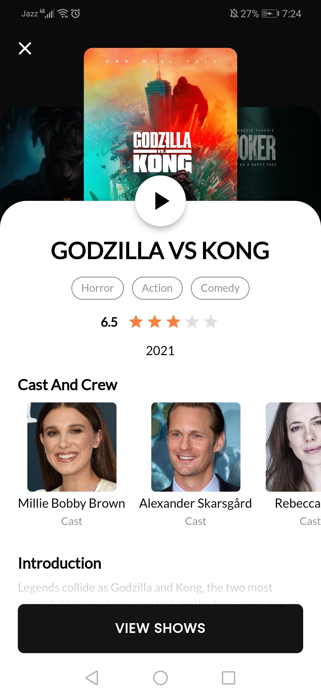
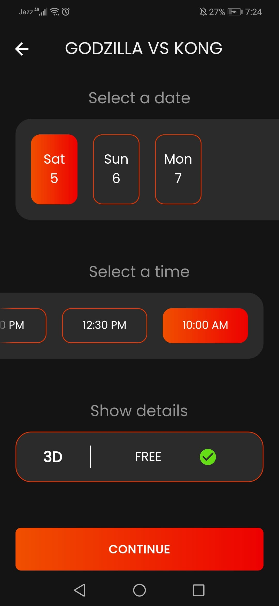
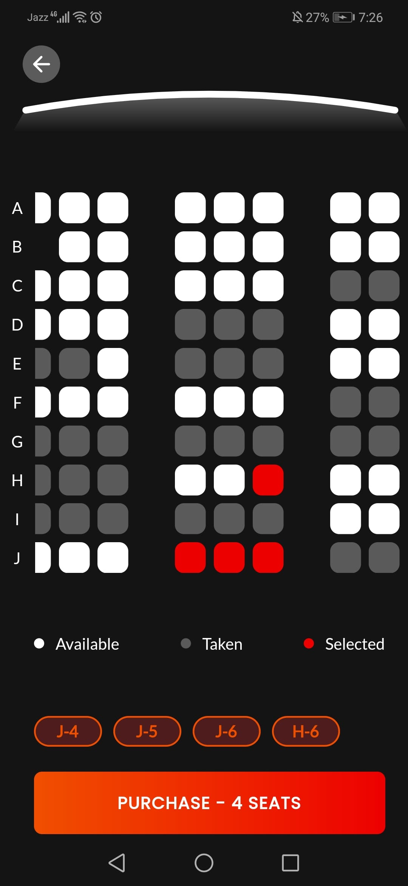
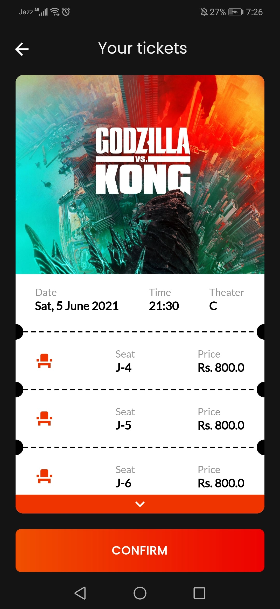
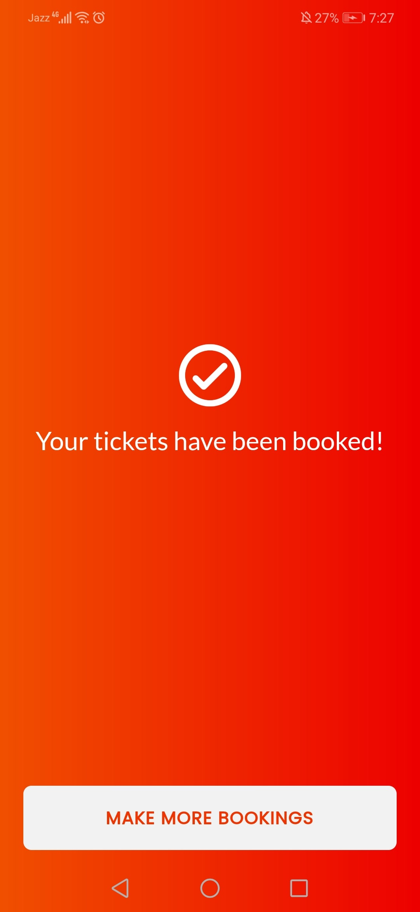
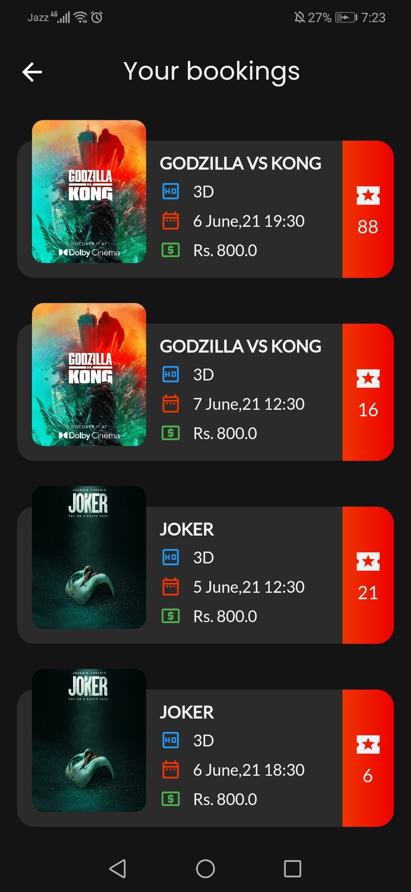
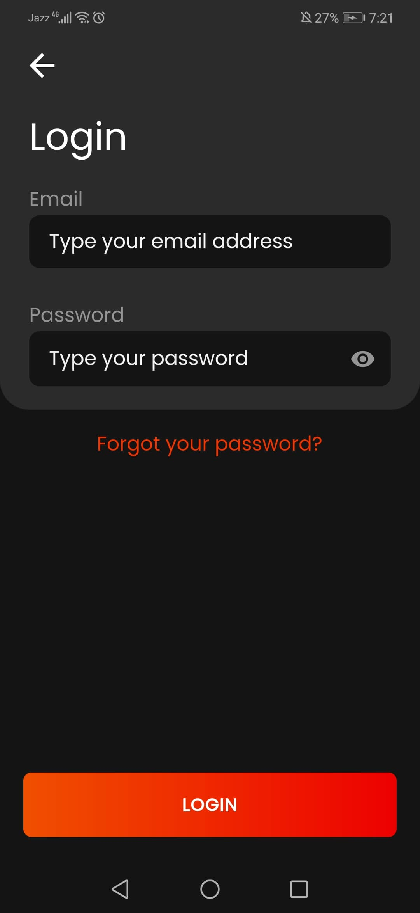
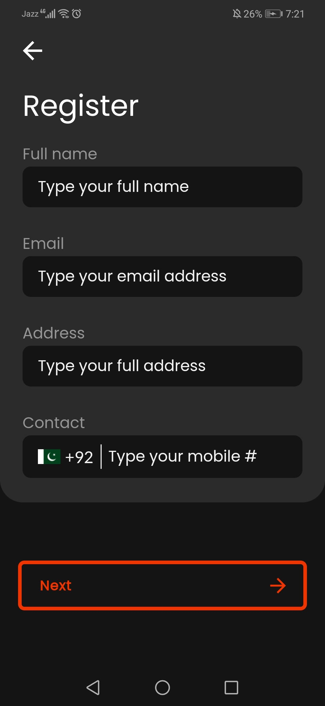
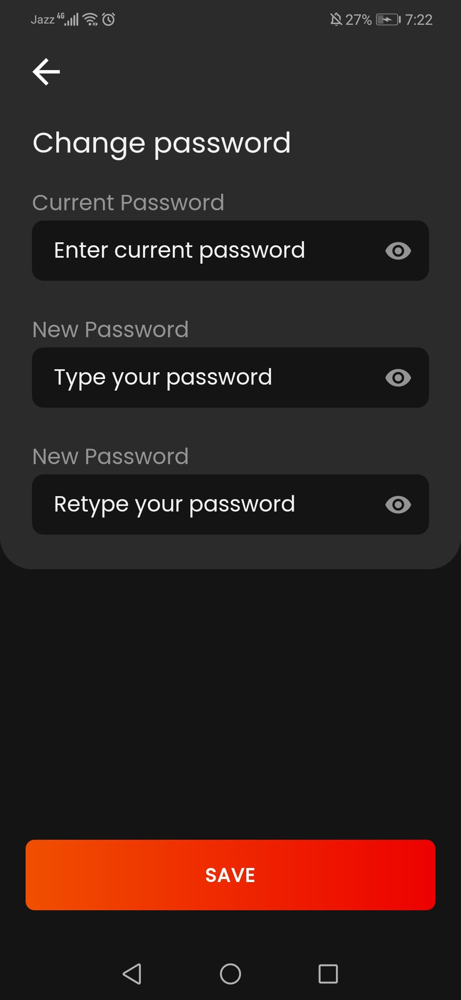
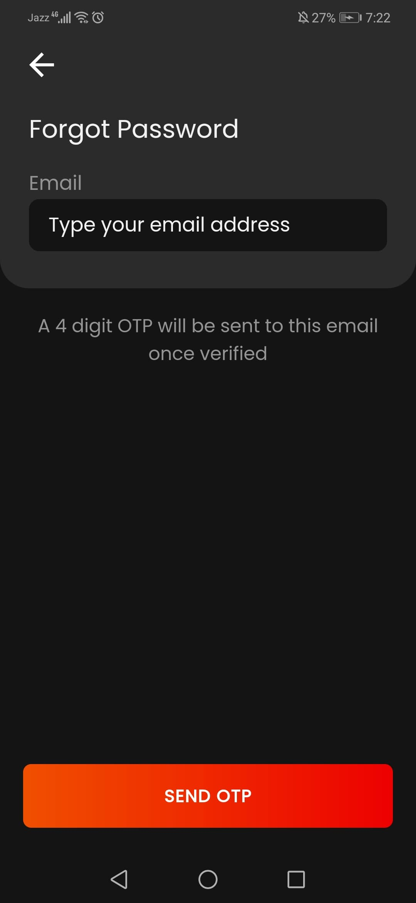

## Backend
For the backend it uses a REST API made using NodeJS and MySQL. Here is the link to it's code [backend]

For more instruction visit the backend [README](https://github.com/arafaysaleem/ez_tickets_backend/blob/master/README.md#rocket-deployement).

# frontend
A ticket booking app made for cinemas [frontend].
Book Tickets is an app made with **Flutter** framework to provide online ticket booking functionality.
**The release apk is available under the release tags. It's also available on this drive link - [Book Tickets APK]**

## Demo
<div align="center">
  <video src="https://user-images.githubusercontent.com/62943972/149531248-ccbd3b54-1ae8-4565-807b-2f8bf2e64d21.mp4"/>
</div>

## Project setup
```
Once deployed, pass the url while running the flutter app like this:

```dart
// Replace your-url-here with your own deployed URL like "https://example.com/api/v1"
flutter run --dart-define=BASE_URL="your-url-here"
```

### App Features
```
- Authentication.
- Browsing movies.
- Viewing movie details.
- Watching movie trailers.
- Checking available movie shows.
- Theater seat map for ticket selection.
- Online ticket booking.
- Online booking payment.
- Viewing ticket bookings history.
```
## :wrench: Technical Features

<table>
    <tr>
        <td><a href="https://pub.dev/packages/riverpod">Riverpod</a> State Management - v1.0.3</td>
        <td><a href="https://pub.dev/packages/dio">Dio</a> + Interceptors For JWT Refresh</td>
    </tr>
    <tr>
        <td><a href="https://pub.dev/packages/freezed">Freezed</a> + <a href="https://pub.dev/packages/flutter_hooks">Flutter Hooks</a> For JSON Handling</td>
        <td>Custom Wrapper For <a href="https://pub.dev/packages/shared_preferences">Shared Prefs</a> + <a href="https://pub.dev/packages/flutter_secure_storage">Flutter Secure Storage</a></td>
    </tr>
    <tr>
        <td>MVC-S Clean Architecture</td>
        <td>Session persistence and encrypted key storage</td>
    </tr>
    <tr>
        <td>Reusable services architecture and code</td>
        <td>Custom reusable widgets</td>
    </tr>
    <tr>
        <td>Unit tested code + Automated Code Coverage</td>
        <td>Dart ENV variables</td>
    </tr>
    <tr>
        <td>Full documentation</td>
        <td>Complex CI/CD Build, Test and Deploy pipelines</td>
    </tr>
    <tr>
        <td>Github Branch Protection + Secrets</td>
        <td>Linting + Custom Analyzer Rules</td>
    </tr>
</table>

### Customize configuration
## 🚀 Technologies

- [Flutter v2.8.1]
- Dart v2.14.4

## :iphone: Screens
:art: The UI is inspired by this [dribbble shot]

Splash Screen | Home Screen | Welcome Screen |
:------------:|:-----------:|:--------------:|
 |  | 
Movie Details Screen | Movies Screen | Movie Trailer Screen |
 |  | 
Shows Screen | Theater Screen | Tickets Screen |
 |  | 
Payment Screen | Confirmation Screen | Some Skeleton Loaders |
 |  | 
Some Skeleton Loaders | Bookings History Screen | Booking Details Screen |
 |  | 
Login Screen | Register Screen | Change Password Screen |
 |  | 
Forgot Password Screen | OTP Screen | OTP Email |
 |  | 

[backend]: <https://github.com/mushlihun/ticketbook/tree/master/nodebackend>
[frontend]: <https://github.com/mushlihun/ticketbook>
[Book Tickets APK]: <https://drive.google.com/file/d/1n1NLNaKK58IyZHnq1ehFZvzZLKmsKjtv/view?usp=sharing->
[dribbble shot]: <https://dribbble.com/shots/8257559-Movie-2-0>
[Flutter v2.8.1]: <https://storage.googleapis.com/flutter_infra_release/releases/stable/windows/flutter_windows_2.8.1-stable.zip>