# Tickets Cinema App - Made With Flutter #
A ticket booking app made for watch cinemas.

[![codecov]](https://codecov.io/gh/mushlihun/ticketbook) [🚀](https://github.com/mushlihun/ticketbook/actions/workflows/PR-merge-build-release.yaml) [![Test PR and Push]](https://github.com/mushlihun/ticketbook/actions/workflows/PR-open-test-build.yaml) [![Pull Request Labeler]](https://github.com/mushlihun/ticketbook/actions/workflows/label.yaml) [![Generate Updated Goldens]](https://github.com/mushlihun/ticketbook/actions/workflows/PR-generate-goldens.yaml) [![GitHub release]](https://github.com/mushlihun/ticketbook/releases) [![GitHub stars]](https://github.com/mushlihun/ticketbook/stargazers) [![GitHub issues]](https://github.com/mushlihun/ticketbook/issues) [](https://github.com/mushlihun/ticketbook/issues?q=is%3Aissue+is%3Aclosed) [](https://github.com/mushlihun/ticketbook/pulls?q=is%3Apr+is%3Aclosed)  [](https://github.com/mushlihun/ticketbook/network) [](https://github.com/mushlihun/ticketbook/blob/master/LICENSE) [](https://flutter.dev/)

EZ Tickets is an app made with **Flutter** framework to provide online ticket booking functionality.
**The release apk is available under the release tags. It's also available on this drive link - [Release APK]**

## Backend
For the backend it uses a REST API made using NodeJS and MySQL. Here is the link to it's code [node_backend]

### Important
Due to privacy and resource abuse concerns I have kept the url of the backend API private and you won't be able to see it. Therefore, if you want to work with this project and make your own edits, than you also need to deploy the backend on your own and pass the **URL** to the flutter app. 
Don't be confused, you **CAN** use my backend code provided above, you just have to deploy it on a server of your own. There are plenty of free options including:
 - Heroku
 - AWS Free Tier
 - Azure etc.

For more instruction visit the backend [README](https://github.com/mushlihun/ticketbook/blob/master/nodebackend/README.md#rocket-deployement).


Once deployed, pass the url while running the flutter app like this:

```dart
// Replace your-url-here with your own deployed URL like "https://example.com/api/v1"
flutter run --dart-define=BASE_URL="your-url-here"
```

## :sparkles: App Features

- Authentication.
- Browsing movies.
- Viewing movie details.
- Watching movie trailers.
- Checking available movie shows.
- Theater seat map for ticket selection.
- Online ticket booking.
- Online booking payment.
- Viewing ticket bookings history.

## :wrench: Technical Features

<table>
    <tr>
        <td><a href="https://pub.dev/packages/riverpod">Riverpod</a> State Management - v1.0.3</td>
        <td><a href="https://pub.dev/packages/dio">Dio</a> + Interceptors For JWT Refresh</td>
    </tr>
    <tr>
        <td><a href="https://pub.dev/packages/freezed">Freezed</a> + <a href="https://pub.dev/packages/flutter_hooks">Flutter Hooks</a> For JSON Handling</td>
        <td>Custom Wrapper For <a href="https://pub.dev/packages/shared_preferences">Shared Prefs</a> + <a href="https://pub.dev/packages/flutter_secure_storage">Flutter Secure Storage</a></td>
    </tr>
    <tr>
        <td>MVC-S Clean Architecture</td>
        <td>Session persistence and encrypted key storage</td>
    </tr>
    <tr>
        <td>Reusable services architecture and code</td>
        <td>Custom reusable widgets</td>
    </tr>
    <tr>
        <td>Unit tested code + Automated Code Coverage</td>
        <td>Dart ENV variables</td>
    </tr>
    <tr>
        <td>Full documentation</td>
        <td>Complex CI/CD Build, Test and Deploy pipelines</td>
    </tr>
    <tr>
        <td>Github Branch Protection + Secrets</td>
        <td>Linting + Custom Analyzer Rules</td>
    </tr>
</table>

## :iphone: Screens
:art: The UI is inspired by this [dribbble shot]

Splash Screen | Home Screen | Welcome Screen |
:------------:|:-----------:|:--------------:|
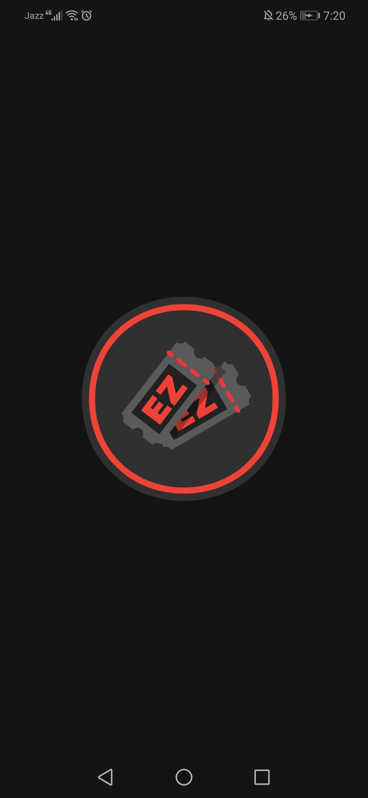 | 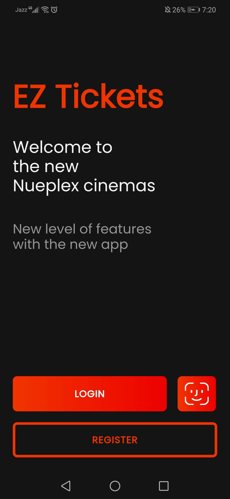 | 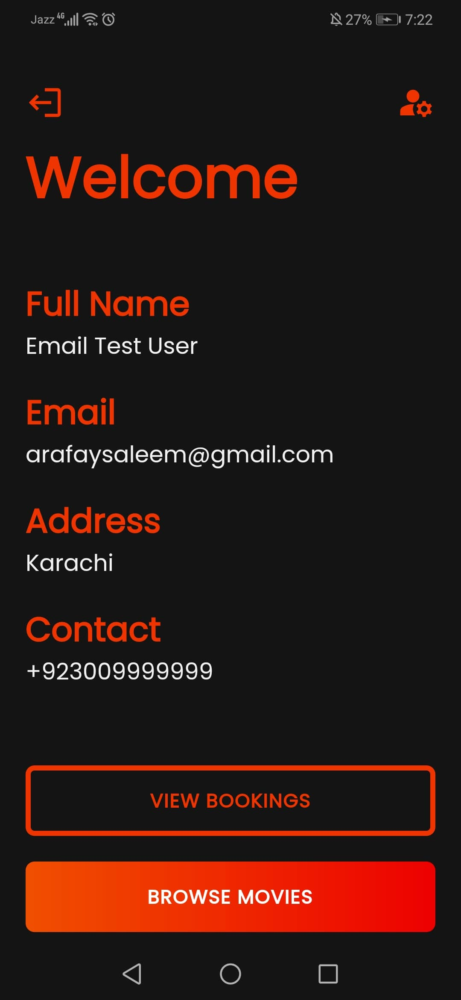
Movie Details Screen | Movies Screen | Movie Trailer Screen |
 | 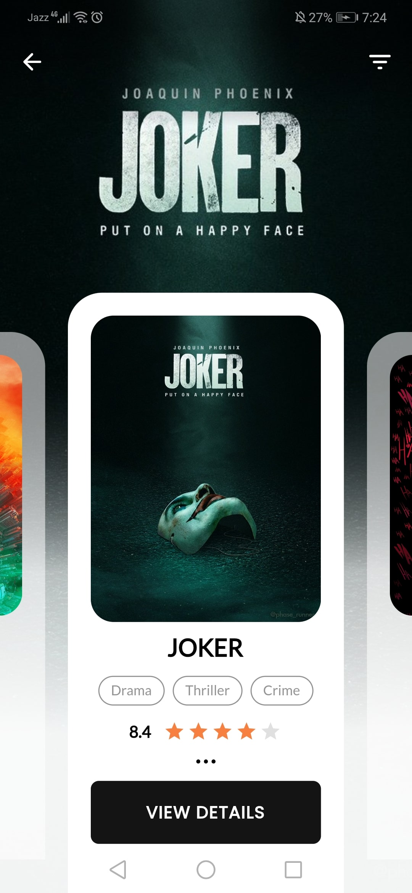 | 
Shows Screen | Theater Screen | Tickets Screen |
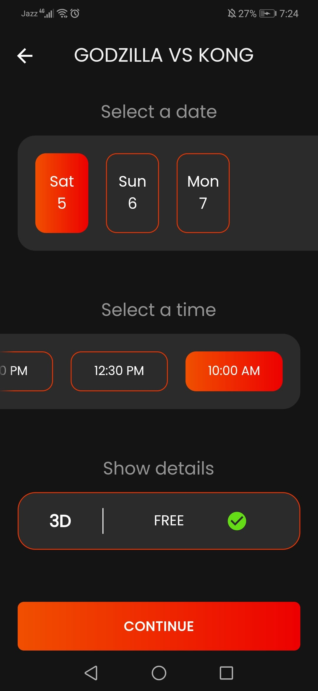 | 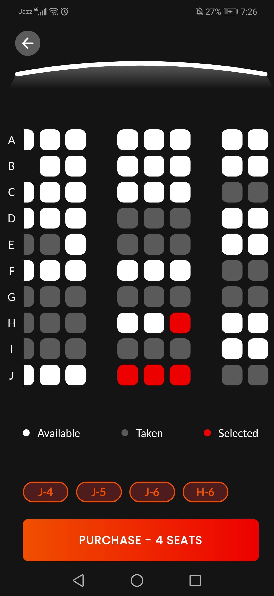 | 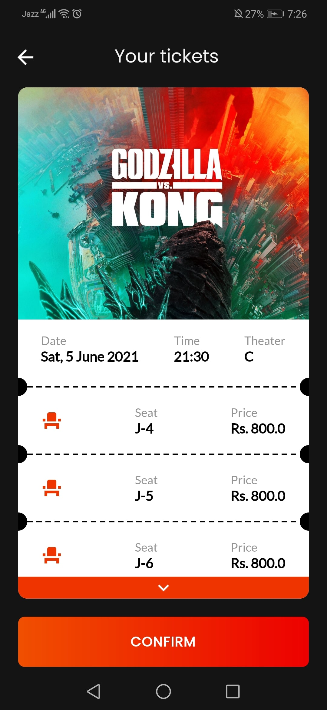
Payment Screen | Confirmation Screen | Some Skeleton Loaders |
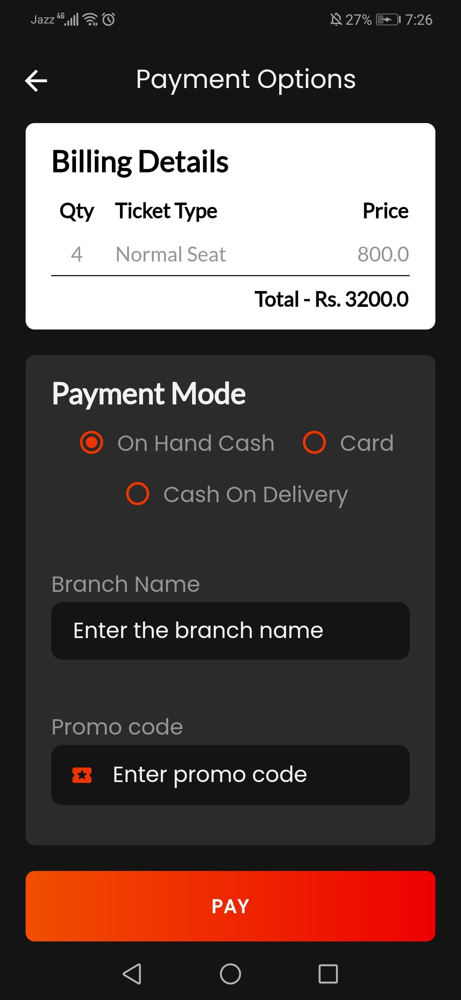 |  | 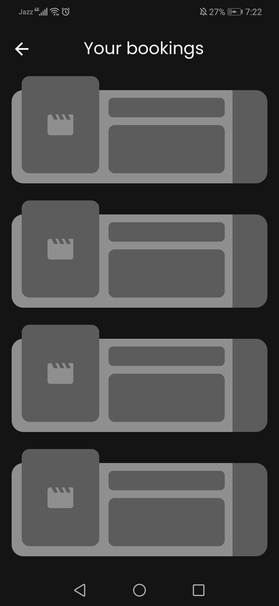
Some Skeleton Loaders | Bookings History Screen | Booking Details Screen |
 | 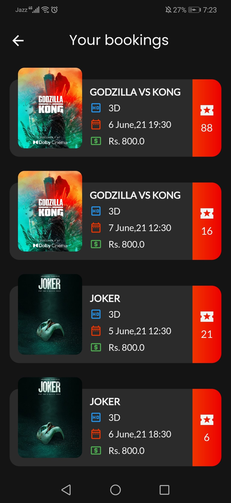 | 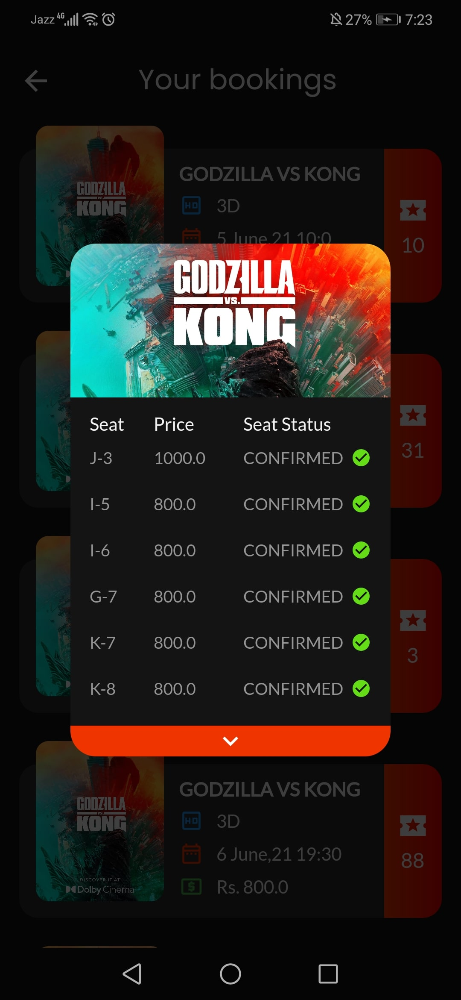
Login Screen | Register Screen | Change Password Screen |
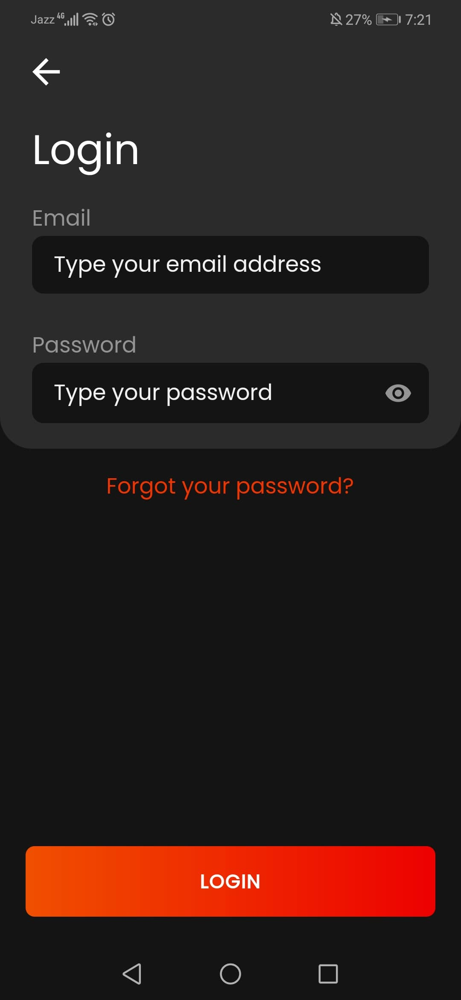 | 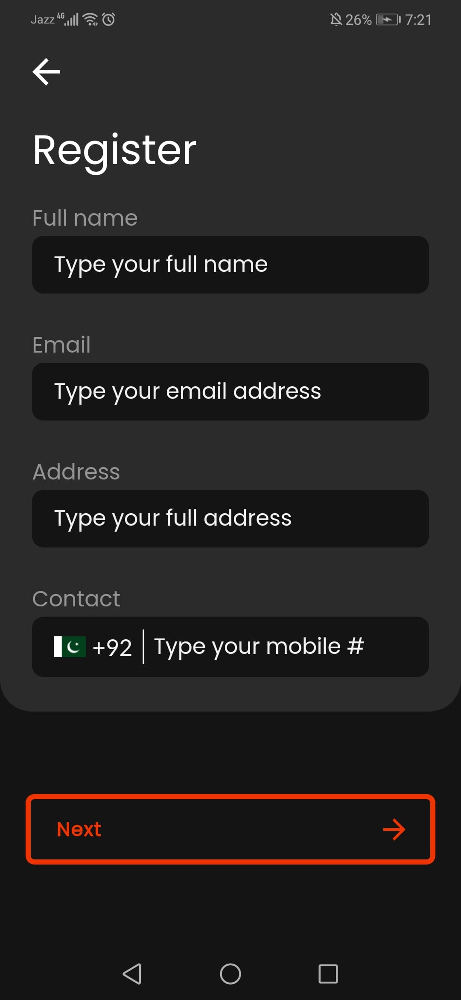 | 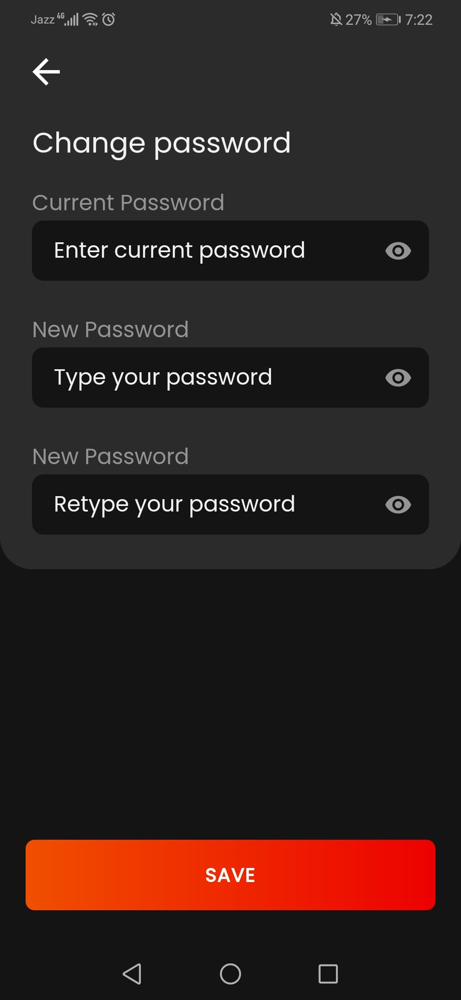
Forgot Password Screen | OTP Screen | OTP Email |
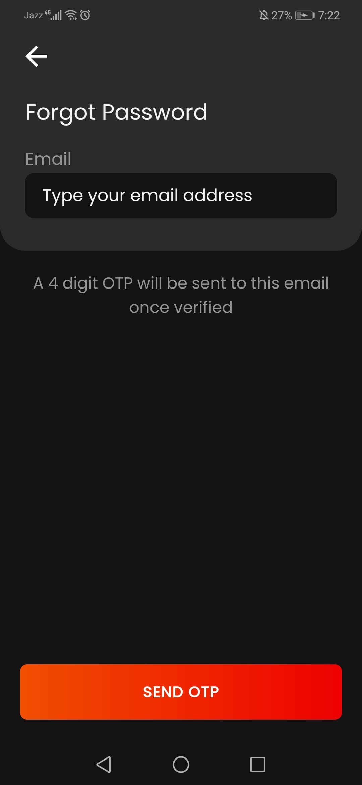 | 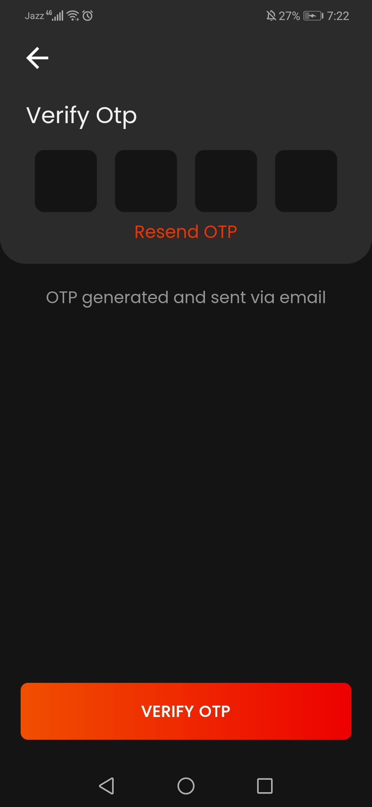 | 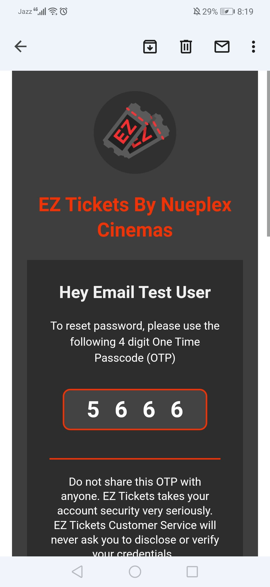

## ⭐ Future Features

- Facial Authentication.
- Cancelling Bookings.
- Movie Reviews.
- FAQ page.

*Feel free to fork and contribute to include these features.* ❤︎

## 🚀 Technologies

- [Flutter v2.8.1]
- Dart v2.14.4

## 🤝 Contribute

To contribute, fork the repository and push the changes to the **master** branch. Then submit a pull request for merging with the source. If your code passes the review and checks it will be merged into the master branch.

## 💬 Feedback

Feel free to send us feedback on [Twitter] or [file an issue]. Feature requests are always welcome.

## 📝 License

Licensed under the [MIT License].

[//]: # (These are reference links used in the body of this note and get stripped out when the markdown processor does its job. There is no need to format nicely because it shouldn't be seen. Thanks SO - http://stackoverflow.com/questions/4823468/store-comments-in-markdown-syntax)

[Github issues]: <https://img.shields.io/github/issues/mushlihun/ticketbook?color=red>
[GitHub stars]: <https://img.shields.io/github/stars/mushlihun/ticketbook?color=orange>
[GitHub release]: <https://img.shields.io/github/release/mushlihun/ticketbook?color=blue>
[Generate Updated Goldens]: <https://github.com/mushlihun/ticketbook/actions/workflows/PR-generate-goldens.yaml/badge.svg>
[Pull Request Labeler]: <https://github.com/mushlihun/ticketbook/actions/workflows/label.yaml/badge.svg>
[Test PR and Push]: <https://github.com/mushlihun/ticketbook/actions/workflows/PR-open-test-build.yaml/badge.svg>
[Build Release APK]: <https://github.com/mushlihun/ticketbook/actions/workflows/PR-merge-build-release.yaml/badge.svg>
[codecov]: <https://codecov.io/gh/mushlihun/ticketbook/branch/master/graph/badge.svg?token=1AL3LTIQE7>
[dribbble shot]: <https://dribbble.com/shots/8257559-Movie-2-0>
[Release APK]: <https://drive.google.com/file/d/1n1NLNaKK58IyZHnq1ehFZvzZLKmsKjtv/view?usp=sharing->
[node_backend]: <https://github.com/mushlihun/ticketbook/tree/master/nodebackend>
[Flutter v2.8.1]: <https://storage.googleapis.com/flutter_infra_release/releases/stable/windows/flutter_windows_2.8.1-stable.zip>
[Twitter]: <https://twitter.com/AbdurRafaySale2>
[file an issue]: <https://github.com/mushlihun/ticketbook/issues/new>
[MIT License]: <./LICENSE>
